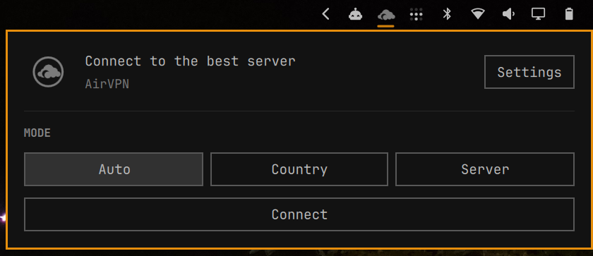
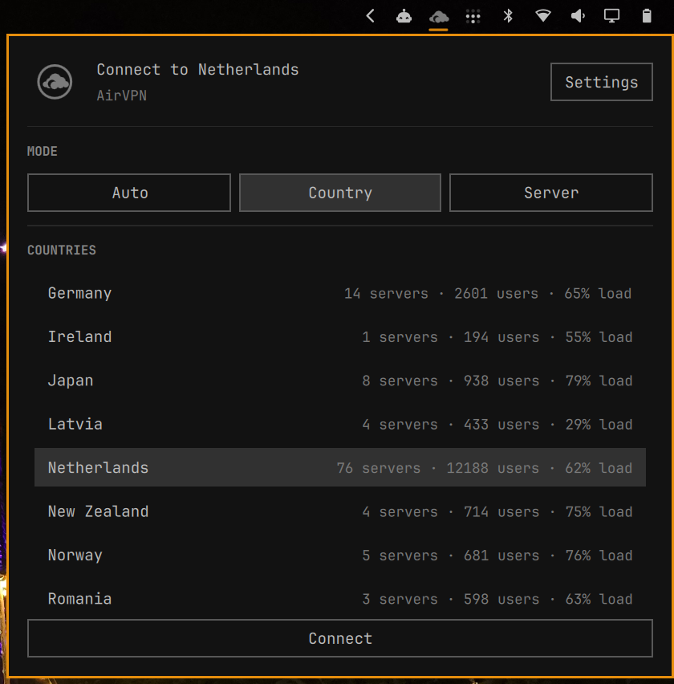
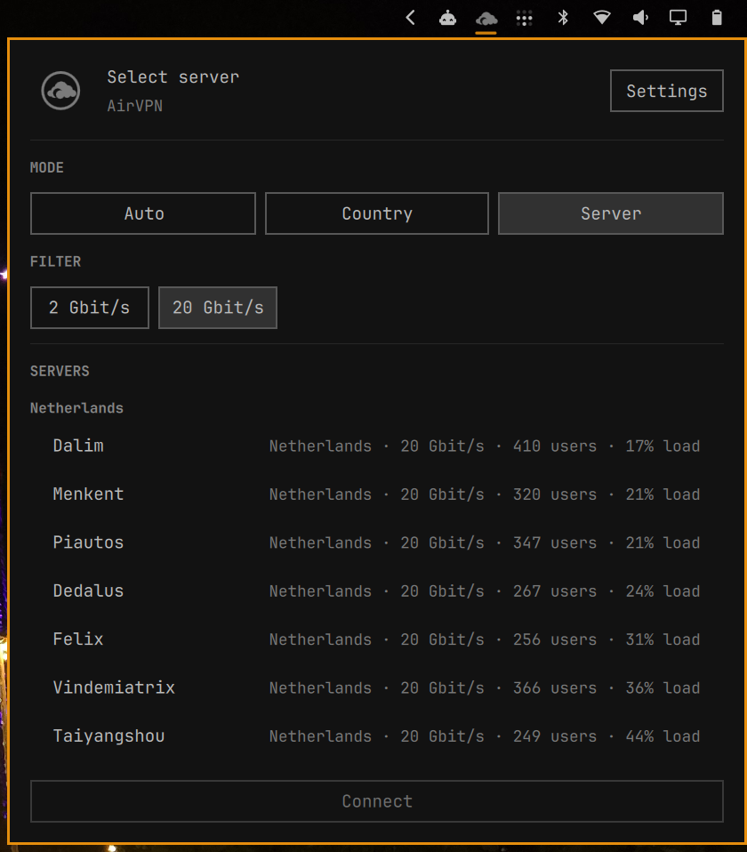

# Omarchy AirVPN

Minimal AirVPN bar widget for Omarchy Quickshell.

## Features

- VPN icon in the bar.
- Left click opens the AirVPN panel.
- Header shows connected/not connected state and current route.
- Mode selector: Auto, Country, Server.
- Bandwidth filter for server selection: 2 Gbit/s and 20 Gbit/s.
- Country and server lists include available AirVPN status metadata when the API exposes it.

## Screenshots







## Requirements

- Omarchy Quattro.
- `nmcli`.
- `curl`.
- `python`.
- `networkmanager-airvpn-core` from AUR.

## Install

```sh
omarchy plugin add https://github.com/spaceXrace/omarchy-airvpn --enable --yes
```

For local development, use `omarchy plugin add file:///path/to/omarchy-airvpn --enable --yes`.

## Uninstall

```sh
omarchy plugin remove spaceXrace.airvpn
```

## AirVPN Setup

Open the AirVPN widget, click **Settings**, open the AirVPN API settings page, paste the API key, and save.

The helper manages a NetworkManager connection named `AirVPN` by default.

## Helper CLI

```sh
bin/omarchy-airvpn status
bin/omarchy-airvpn countries --filter auto
bin/omarchy-airvpn servers --filter 20gbit
bin/omarchy-airvpn connect --mode auto --filter 20gbit
bin/omarchy-airvpn connect --mode country --country ch
bin/omarchy-airvpn connect --mode server --server Achernar
bin/omarchy-airvpn disconnect
bin/omarchy-airvpn save-settings --api-key YOUR_KEY
```

## Notes

AirVPN status data is cached for five minutes under `~/.cache/omarchy-airvpn/`.

This project is not affiliated with, endorsed by, or sponsored by AirVPN.

If you like this plugin, consider using my referral link: https://airvpn.org/?referred_by=619550
